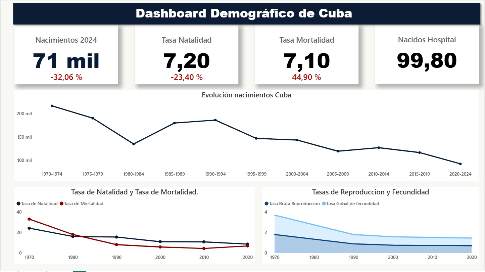
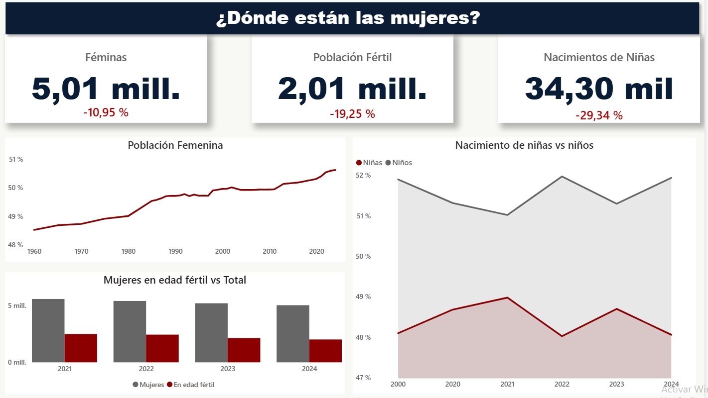
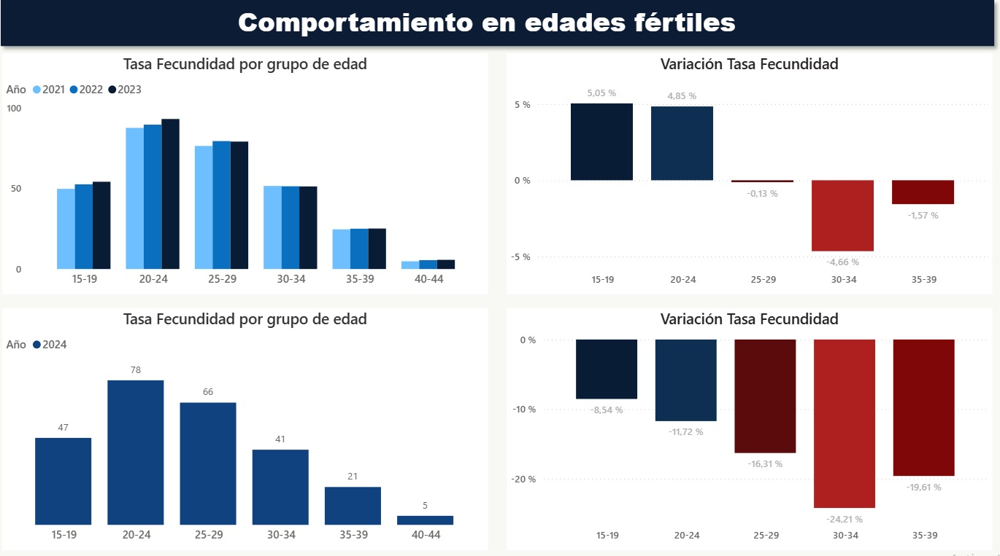

# Análisis Demográfico y Natalidad en Cuba (1970-2024)

## 📌 Sobre el Proyecto
Este proyecto es un análisis profundo de la crisis demográfica en Cuba, utilizando datos públicos del **Anuario Estadístico de Salud**. El objetivo principal fue transformar documentos PDF densos en un modelo de datos relacional interactivo para descubrir las verdaderas causas detrás de la caída de la natalidad en el país.

A través de técnicas de **Data Storytelling**, el tablero no solo muestra "qué" está pasando, sino "por qué", cruzando variables históricas, y de género.

---

## 📊 Hallazgos Clave (Insights)

### 1. El Colapso Histórico y el Cruce de Líneas
* Los nacimientos en 2024 (71 mil) representan una caída del **32%** solo en comparación con 2020.
* La Tasa de Mortalidad ha subido un **44.9%** desde 2020, acercándose peligrosamente a la Tasa de Natalidad, evidenciando un envejecimiento poblacional acelerado y falta de reemplazo generacional.

>

### 2. ¿Dónde están las mujeres? (La Paradoja Demográfica)
* Aunque las mujeres siguen siendo mayoría (más del 50%), en números absolutos la población general y femenina está cayendo.
* El núcleo del problema: La población de mujeres en **edad fértil (15-49 años) se ha desplomado un 19.25%**.
* El nacimiento de niñas ha caído casi un 30%, comprometiendo la base reproductiva futura.

> 

### 3. La Ruptura Estructural de 2024
* El grupo de 30 a 34 años (madurez profesional/estabilidad) fue el que más colapsó en 2024, cayendo un **24%**. La maternidad no se está posponiendo, está desapareciendo.
* **La resistencia adolescente:** El embarazo adolescente (15-19 años) fue el que menos disminuyó (solo 9%), convirtiéndose de manera preocupante en el tercer grupo poblacional que más nacimientos aporta al país.

> 

---

## 🛠️ Proceso Técnico y Metodología

### 1. Extracción y Limpieza (ETL) con Power Query
* **Extracción:** Importación de tablas cruzadas desde archivos PDF (Anuarios)
* **Transformación:** Uso intensivo de la función **Anular dinamización de otras columnas (Unpivot)** para transformar matrices anchas (Provincias x Edades) en tablas tabulares optimizadas para bases de datos.
* **Limpieza:** Eliminación de totales anidados, estandarización de tipos de datos y limpieza de caracteres especiales.

### 2. Modelado de Datos
* Creación de un modelo relacional conectando tablas de hechos (Natalidad, Fecundidad) con tablas dimensionales (Años) mediante relaciones de **1 a varios (1:*)**.

### 3. Cálculos con DAX
* Uso de **Variables (VAR)** para optimizar el rendimiento de las medidas.
* Cálculo de variaciones porcentuales dinámicas (Ej. Crecimiento vs 2020) utilizando funciones `CALCULATE`, `MAX` y `DIVIDE`.
* Agrupación de datos históricos mediante columnas calculadas (Ej. creación de Quinquenios y Décadas usando la función `MOD`).

### 4. Visualización y Diseño (UI/UX)
* Aplicación de **Formato Condicional** en KPIs (Rojo/Verde) respetando la polaridad de la métrica (Ej. aumento de mortalidad = Rojo).
* Uso de **Gráficos de Áreas Apiladas** para enfatizar brechas de género.
* Diseño minimalista con paleta de colores corporativa (Azul marino, Gris, Rojo Borgoña) para guiar la atención del usuario hacia los datos críticos.

---

## 📂 Estructura del Repositorio
* `PAMI Natalidad Cuba 2024.pbix`: Archivo interactivo de Power BI.
* `Datos/`: Carpeta con los archivos fuente (PDF/Excel).
* `Imagenes/`: Capturas de pantalla del tablero.
* `PAMI Natalidad Cuba 2024.pdf`: Versión estática del reporte.
